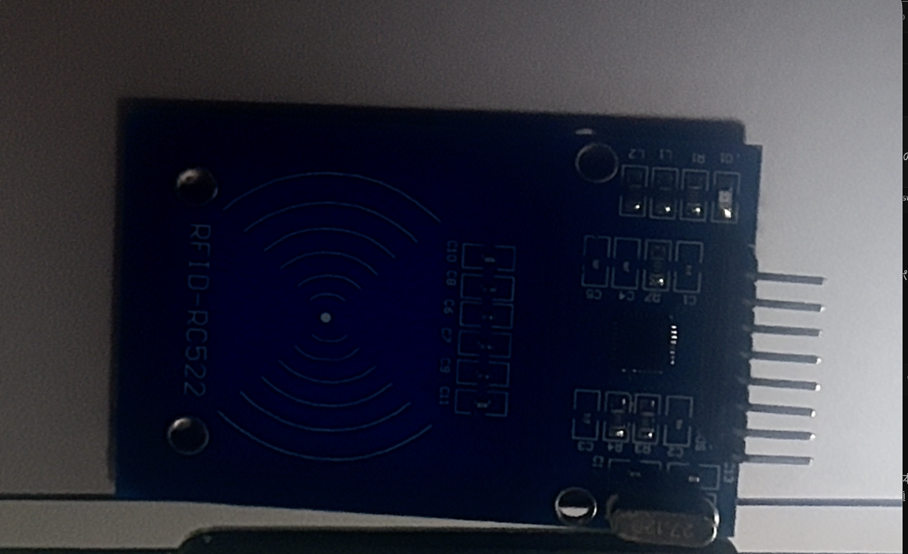
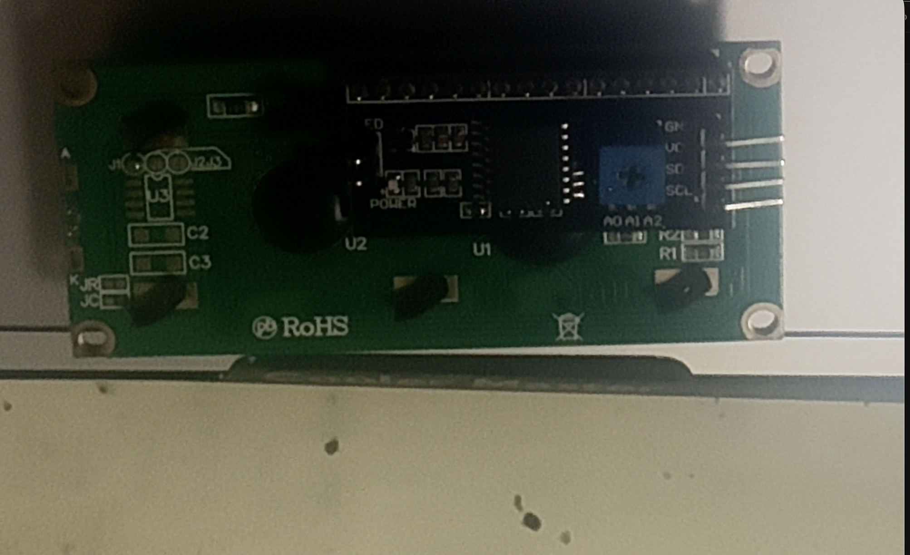
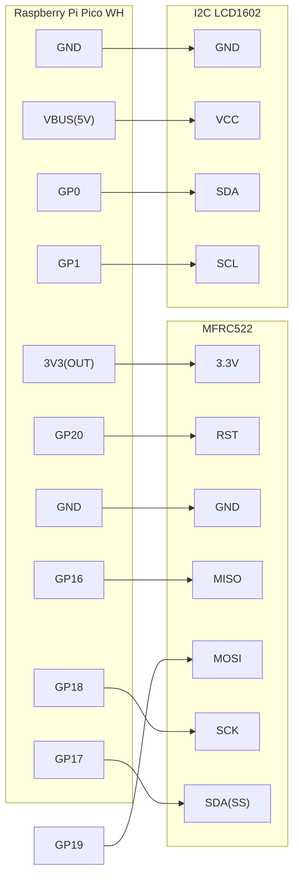
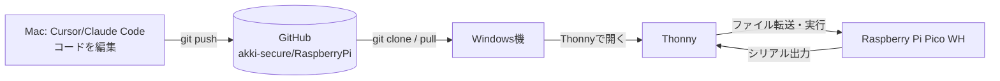

# RFIDタグ検知 → LCD表示（Raspberry Pi Pico WH / MicroPython）

MFRC522(RFIDリーダー)でタグを検知したら、I2C接続のLCD1602に "Hello World!" と表示するプロジェクトです。

詳しい要件は [docs/requirements.md](docs/requirements.md) を参照してください。

## 必要なもの
- Raspberry Pi Pico WH
- MFRC522 RFIDモジュール（RC522）＋ RFIDカードまたはキーフォブ
- I2C LCD1602（PCF8574 I2Cバックパック付き）
- ブレッドボード・ジャンパー線
- Windows機（Thonnyインストール用）とMac（コード作成用）

実際に使用する部品（写真はユーザー実機を撮影したもの）:

| MFRC522 RFIDモジュール | I2C LCD1602（裏面/PCF8574バックパック） |
|---|---|
|  |  |

## 配線図



### 配線表

**MFRC522 (SPI0)**
| MFRC522ピン | Pico WH GPIO |
|---|---|
| 3.3V | 3V3(OUT) |
| RST | GP20 |
| GND | GND |
| IRQ | 未接続(NC) |
| MISO | GP16 |
| MOSI | GP19 |
| SCK | GP18 |
| SDA(SS/CS) | GP17 |

**I2C LCD1602 (I2C0)**
| LCDバックパックピン | Pico WH GPIO |
|---|---|
| GND | GND |
| VCC | VBUS(5V) |
| SDA | GP0 |
| SCL | GP1 |

**⚠️ 注意**: MFRC522は3.3V専用です。5Vに接続すると壊れます。VCCは必ずPicoの`3V3(OUT)`ピンに接続してください。

## 開発の全体フロー

コード作成用のMacと、Pico書き込み用のWindows機が別なので、GitHubリポジトリを介してファイルをやり取りします。



## セットアップ手順（Windows機・Thonny）

1. [Thonny公式サイト](https://thonny.org/)からインストーラーをダウンロードしてインストールする
2. Pico WHをUSBケーブルでWindows機に接続する
3. Thonnyを起動し、右下のインタプリタ選択から「MicroPython (Raspberry Pi Pico)」を選ぶ（初回はPico側にMicroPythonファームウェアの書き込みが必要な場合があります。Thonnyの案内に従ってください）
4. GitHubリポジトリをWindows機にclone、または最新をpullする
   ```
   git clone https://github.com/akki-secure/RaspberryPi.git
   ```
5. Thonnyの「ファイル」パネルで、ローカルの`src/lib/`配下の3ファイル（`mfrc522.py`, `lcd_api.py`, `i2c_lcd.py`）と`src/logic.py`を、Pico側の`/lib`フォルダへアップロードする（`/lib`フォルダがなければ作成する）
6. `src/main.py`をPico側のルート（`/`）へ`main.py`という名前でアップロードする
7. Thonnyで`main.py`を開き、実行ボタン（▶）を押す
8. シェル(シリアル出力)に`{"ts": ..., "level": "INFO", "event": "startup"}`のようなログが出れば起動成功

## 動作確認
1. RFIDタグ（カードまたはキーフォブ）をMFRC522モジュールにかざす
2. LCDに "Hello World!" と表示される
3. Thonnyのシェルに`tag_detected`のログが出る

うまく表示されない場合は`tools/i2c_scan.py`をThonnyで実行し、LCDのI2Cアドレスが見つかっているか確認してください。

## フォルダ構成
```
RaspberryPi/
├── README.md
├── docs/requirements.md      # 要件定義書
├── src/
│   ├── main.py                # Pico実行エントリ
│   ├── logic.py                # ハードウェア非依存ロジック(日本語関数名)
│   └── lib/                    # 外部OSSライブラリ(MITライセンス、出典はファイル先頭に明記)
├── tests/                      # PC側pytest
├── tools/i2c_scan.py           # LCDのI2Cアドレス確認用
├── .claude/commands/           # Claude Codeスラッシュコマンド
└── requirements-dev.txt        # PC側テスト・静的解析用
```

## 開発フロー（git運用）
- `main`ブランチには直接コミット・pushしない
- 機能追加は`feature/xxx`ブランチで作業し、動作確認後に`main`へ統合する

## テスト・静的解析（PC側、Mac/Windowsどちらでも可）
```
python3 -m venv .venv
.venv/bin/pip install -r requirements-dev.txt
.venv/bin/pytest tests/
.venv/bin/ruff check src tests
```
`pytest`は通常数秒で完了します。**30分以上かかる場合はフリーズの可能性が高いため、実行を止めて確認してください。**

## 今後の拡張について
表示内容を増やす・複数タグを識別する等の機能追加を行った場合は、このREADMEの配線図・フォルダ構成、および`docs/requirements.md`を必ず更新してください。API化やWeb連携など機能が拡張された場合は、その時点でAPI仕様書等を別途追加します。
